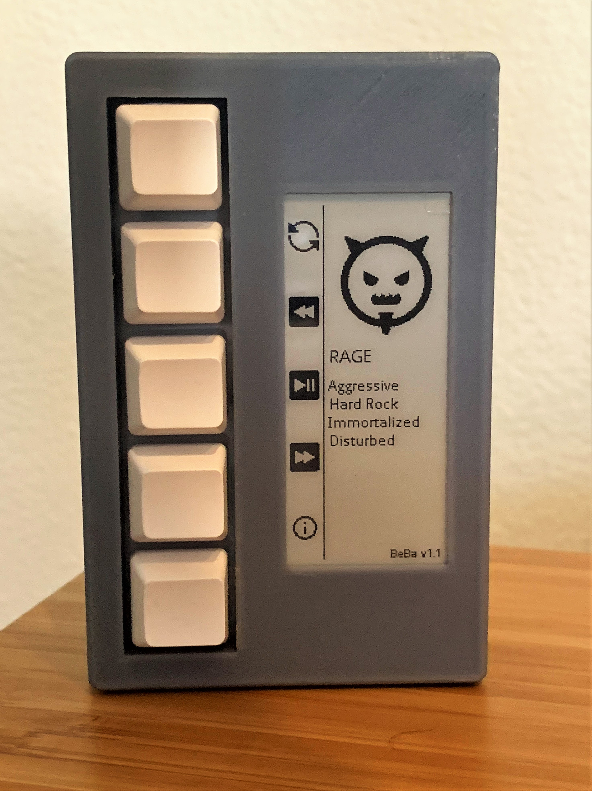

# beba
 Music curated by an AI through mood

## How it Works
BeBa takes in different "mood changers" (book reviews, weather reports, etc.) and feeds that into a prompt to openAI's LLM to determine its current mood. From there it uses that mood to determine what music it would like to listen to, and searches for a playlist matching that on spotify. It also chooses what image to use to represent its own mood.

## Requirements
- Spotify API key
- OpenAI API key
- Python 3+

### Optional
- NYTimes API Key (used to get news, movies, books to determine mood)

## Setup

1. Install dependencies

    `pip install -r requirements.txt`

2. Set API keys and playback device info in `.env` file
    - _You can use the `.env.template` file as reference (rename to .env with your configuration set)_

## Run

`python src/main.py`

- Use keyboard to control (play/pause, start new mood, etc.)
- env variable `NEW_MOOD_TIMER_MINUTES` will automatically generate a new mood and kick off the playlist it found every X minutes (defaults to every hour)

## (Optional) Raspberry Pi Setup

### Requirements
- Raspberry Pi (tested on 4B 4GB)
- Waveshare 2.9 inch ePaper Display 296x128 pixels
    - If you do not want to use this display, do not set RASPBERRY_PI_DISP env variable
- Keyboard (5 keys required)

### Setup
- Clone repo onto Raspberry Pi
- Set up .env file
    - If using ePaper display, set `RASPBERRY_PI_DISP=true`
- Run `raspberry_pi/setup.sh` and follow instructions after it completes
- Test that everything is working by manually running `raspberry_pi/startup.sh`, then restart Raspberry Pi (startup.sh should run on reboot)

### What `setup.sh` Does
- Installs necessary dependencies
- Runs `pip install -r requirements.txt`
- Installs `raspotify`
- Walks through instructions to configure `raspotify` + have `setup.sh` run on startup

## Troubleshooting

See log file generated with name `beba.log`

## Etymology
Named after Bela Bartok, a founder of ethnomusicology.
https://en.wikipedia.org/wiki/B%C3%A9la_Bart%C3%B3k

## Author
 Michael Kukar

## License

Icons provided by https://icons8.com

See LICENSE.md file